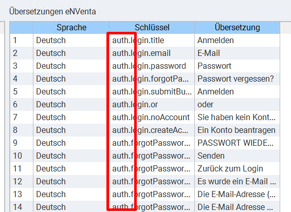

# Translation (i18n)

## Get translation by language and scope

This endpoint allows you to get the translations by language and scope.</br>

The scope ist the top level node of the key field.</br>


**URL** : `/translation/:scope/:language`

**Example** : `/translation/auth/de`

**Method** : 

**Auth required** : No

**Permissions required** : No

### Success Response

**Condition** : If translations are found.

**Code** : `200 OK`

**Content example**

```json
{
    "forgotPassword": {
        "backToLogin": "Zurück zum Login",
        "emailError": "Die E-Mail-Adresse {{email}} ist in unserem System nicht vorhanden!",
        "emailInput": "E-Mail",
        "emailRequired": "Die E-Mail Adresse muss zwingend eingegeben werden!",
        "emailSuccess": "Es wurde ein E-Mail mit einem Link um das Passwort zurück zu setzen an {{email}} versendet",
        "emailValid": "Bitte geben Sie eine gültige E-Mail-Adresse ein",
        "submitButton": "Senden",
        "title": "PASSWORT WIEDERHERSTELLEN"
    }
}
```